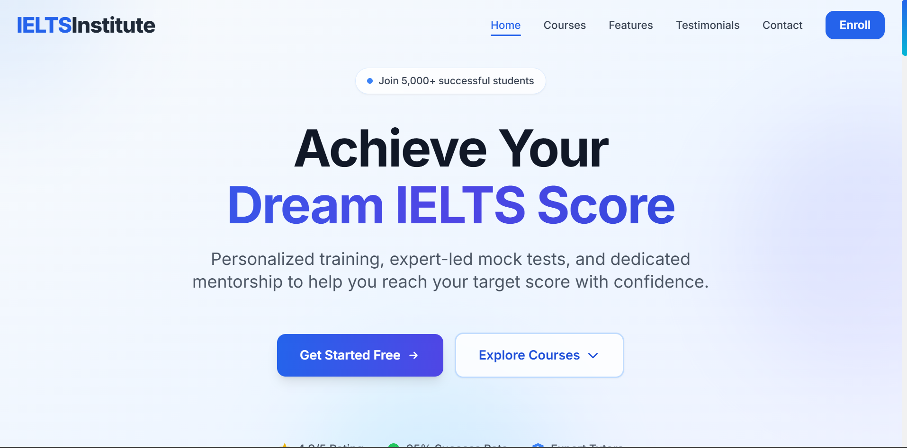
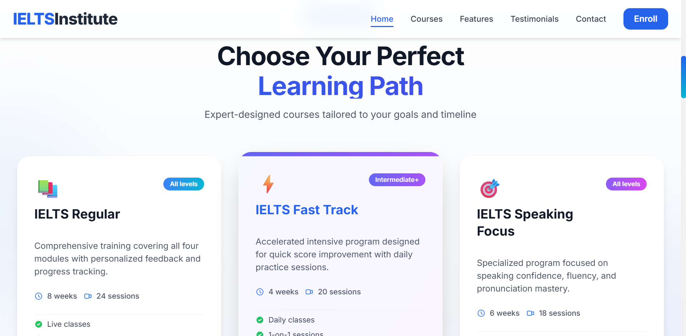
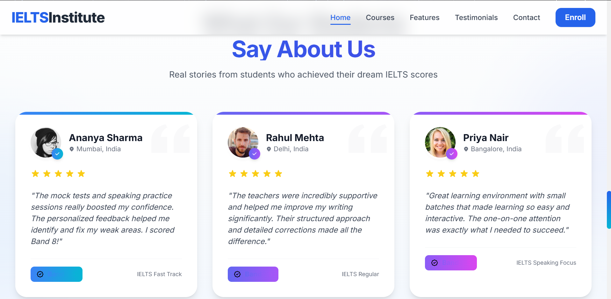

# Best IELTS Training Center


## Live Demo
Check out the live version of the project here:  
[🌐 Live Demo](https://ielts-institute-landing.vercel.app/)

A **modern, responsive landing page** for an IELTS coaching institute built with **React**, **Tailwind CSS**, and **Vite**. This project demonstrates professional UI/UX design and responsive frontend development skills for students preparing for IELTS exams.

---
## Website Preview

### Homepage


### Courses Section


### Testimonials Section



---

## 🌟 Features

- **Responsive Design:** Works seamlessly on mobile, tablet, and desktop.  
- **Hero Section:** Eye-catching call-to-action with gradient background and subtle animations.  
- **Courses Section:** Modern cards with hover animations and interactive CTA buttons.  
- **Modal Forms:** User-friendly enrollment forms with keyboard accessibility and validation-ready inputs.  
- **SEO Optimized:** Meta tags, Open Graph, Twitter Cards, and canonical links.  
- **Performance Ready:** Optimized for fast loading using Vite and Tailwind CSS.

---

## 🎨 Design Choices

- **Typography:** Inter font for modern readability and clean UI.  
- **Colors:** Blue gradients for primary actions; white/gray backgrounds for content clarity.  
- **Animations:** Subtle hover/scale effects on buttons and cards to enhance interactivity.  
- **UX:** Clear call-to-action, visual hierarchy, consistent spacing, and mobile-first responsiveness.  
- **Consistency:** Hero, Courses, and Modal sections share cohesive styling for a professional look.  

---

## 🛠 Tech Stack

- **React** (Functional Components, JSX)  
- **Tailwind CSS** (Utility-first styling)  
- **Vite** (Fast development server and build tool)  
- **HTML5 & CSS3**  

---

## 🚀 Setup Instructions

Follow these steps to run the project locally:

### 1. Clone the repository
```bash
git clone https://github.com/<your-username>/ielts-institute-landing.git
cd ielts-institute-landing
```
### 2. Install dependencies
```bash
npm install
```
### 3. Start the development server
```bash
npm run dev
```
Open http://localhost:5173 in your browser to view the project.
### 📂 Recommended Folder Structure
```
ielts-institute-landing/
│
├─ public/
│   └─ vite.svg
├─ src/
│   ├─ components/
│   │   ├─ Hero.jsx
│   │   ├─ Navbar.jsx
│   │   ├─ Courses.jsx
│   │   ├─ Modal.jsx
│   │   └─ Footer.jsx
│   ├─ App.jsx
│   ├─ main.jsx
│   └─ index.css
├─ package.json
├─ tailwind.config.js
├─ postcss.config.js
└─ README.md
```


